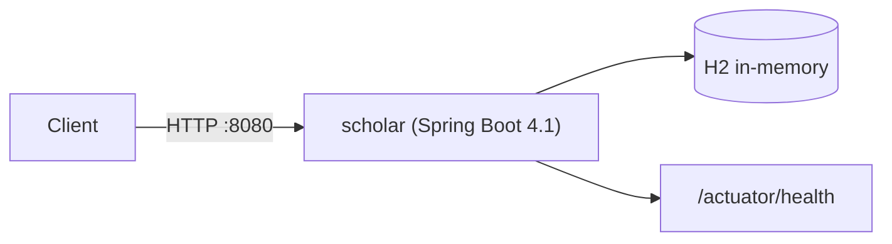

# Current Architecture

마지막 갱신: 2026-08-19 (bootstrap)

## 지금 모습

단일 Spring Boot 애플리케이션 하나뿐입니다. 외부 인프라는 없습니다.



| 구성 요소 | 내용 |
| --- | --- |
| 런타임 | Java 21, Spring Boot 4.1.0 |
| 빌드 | Gradle (wrapper 9.5.1), 단일 모듈 |
| 웹 | Spring MVC (`spring-boot-starter-webmvc`), Bean Validation |
| 영속성 | Spring Data JPA + H2 (in-memory, 애플리케이션 종료 시 소멸) |
| 모듈성 | Spring Modulith 2.1 (아직 모듈 없음) |
| 운영 | Actuator — `health`만 노출 |
| base package | `dev.systemdesign.scholar` |

아직 비즈니스 기능은 없습니다. Chapter를 진행하면서 하나씩 추가합니다.

## 설정 규칙

- 설정 파일은 `src/main/resources/application.yaml` 하나만 사용합니다.
  같은 위치에 `application.properties`가 있으면 그쪽이 우선하므로 추가하지 않습니다.
- 환경에 따라 달라지는 값은 `${ENV_NAME:default}` 패턴으로 선언하고,
  로컬 값은 저장소 루트의 `.env`(git 미포함, `.env.example` 참고)에서 덮어씁니다.
- 우선순위: `application.yaml` < `.env` < 실제 OS 환경변수 < 시스템 프로퍼티 < CLI 인자.
- `spring.jpa.hibernate.ddl-auto`는 설정하지 않습니다.
  Boot 기본값이 임베디드 DB면 `create-drop`, 실제 DB면 `none`이라 그대로 두는 게 안전합니다.
- Actuator는 `health`만 노출합니다. Spring Security가 없으므로 노출 범위를 넓히면
  그대로 인증 없이 공개됩니다. 넓힐 때는 PR에서 이유를 설명합니다.

## Spring Modulith

기동 로그의 다음 경고는 **정상**입니다.

```text
No application modules detected!
```

아직 애플리케이션 모듈이 하나도 없기 때문입니다.
이 경고를 없애려고 의미 없는 더미 모듈이나 빈 패키지를 만들지 않습니다.

### 앞으로의 모듈 구조

`@SpringBootApplication`이 있는 `dev.systemdesign.scholar`의 **직속 하위 패키지 하나 = 애플리케이션 모듈 하나**가 기본 규칙입니다.

```text
dev.systemdesign.scholar
├── ratelimiter
├── shorturl
├── notification
├── feed
└── chat
```

각 모듈의 최상위 패키지에 있는 타입만 다른 모듈에서 접근할 수 있고,
하위 패키지(`…/ratelimiter/internal` 등)는 내부 구현으로 취급됩니다.
경계를 넘는 참조가 필요하면 그 자체가 설계 논의 대상입니다.

### 첫 모듈이 생기면 추가할 테스트

지금은 추가하지 않습니다. 실제 모듈이 하나라도 생기면 아래 테스트를 넣습니다.

```java
package dev.systemdesign.scholar;

import org.junit.jupiter.api.Test;
import org.springframework.modulith.core.ApplicationModules;
import org.springframework.modulith.docs.Documenter;

class ModularityTests {

    static final ApplicationModules modules = ApplicationModules.of(ScholarApplication.class);

    @Test
    void verifiesModularStructure() {
        modules.verify();   // 순환 참조 · 모듈 경계 위반 검출
    }

    @Test
    void writesDocumentationSnippets() {
        new Documenter(modules).writeDocumentation();
    }
}
```

- `Documenter`는 `build/spring-modulith-docs/` 아래에 C4 PlantUML 다이어그램과
  모듈 캔버스(`module-<name>.adoc`)를 만듭니다.
- 추가로 `build/resources/main/META-INF/spring-modulith/application-modules.json`도 씁니다.
  이 파일이 런타임 클래스패스에 있으면 actuator가 **빌드 시점에 고정된 모듈 정보**를 서빙합니다.
- `/actuator/modulith` 엔드포인트를 보려면 노출 설정을
  `management.endpoints.web.exposure.include: "health,modulith"`로 넓혀야 합니다.

## 아직 없는 것 (의도적으로)

Redis, Kafka, PostgreSQL, 메시지 브로커, Docker Compose, API Gateway, Kubernetes,
서비스 분리 — 전부 없습니다.
필요성이 실제 문제로 드러났을 때 도입하고, 그때 [ADR](adr/README.md)과
[Evolution](evolution.md)에 기록합니다.
