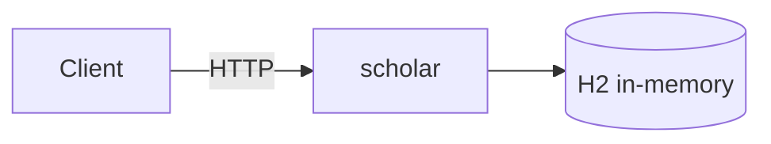

# Architecture Evolution

시스템이 Chapter를 진행하면서 어떻게 변해 왔는지를 기록합니다.

이 문서의 핵심은 **무엇을 추가했는지가 아니라, 기존 구조로 왜 부족했는지**입니다.
"Redis를 붙였다"가 아니라 "인스턴스를 2대로 늘리자 인스턴스별 카운터가 각각 세어져
전체 한도가 2배가 됐다 → 공유 카운터가 필요했다"를 남깁니다.

## 진화 로그

| # | 단계 | 계기가 된 문제 | 추가/변경한 것 | 기록 |
| --- | --- | --- | --- | --- |
| 0 | Initial | — (시작점) | Spring Boot 4.1 + H2 단일 애플리케이션 | [Current](current.md) |

## 현재 형태



## 기록하는 방법

새 단계를 추가할 때 위 표에 한 줄을 넣고, 아래 형식으로 절을 추가합니다.

```markdown
## N. <단계 이름>

**문제**  무엇이 부족했는가. 가능하면 측정값으로.
**대안**  무엇을 검토했는가.
**선택**  무엇을 도입했는가. (ADR 링크)
**결과**  도입 후 어떻게 달라졌는가. 가능하면 측정값으로.
**남은 문제**  이 선택으로 새로 생긴 부채.
```

기술을 도입할 때는 [ADR](adr/README.md)을 함께 남기고,
[Current](current.md)의 그림과 표도 같이 갱신합니다.
